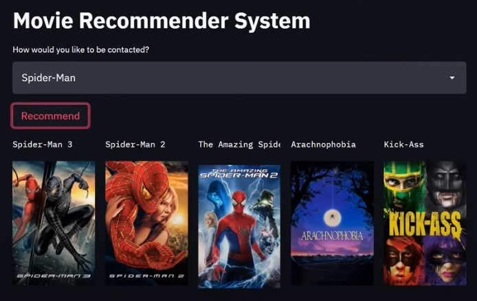

# 🎬 Movie Recommender System

A simple content-based movie recommendation app built using **Python**, **Streamlit**, and **TMDb API**. Given a movie name, it suggests 5 similar movies along with their posters.

---

## 🚀 Features

- 🔍 Select a movie from a dropdown list
- 🤖 Get 5 similar movies based on content similarity
- 🎞️ View posters fetched via **TMDb API**
- 🧠 Recommendation powered by cosine similarity on movie tags

---

## 🛠️ Tech Stack

- Python
- Streamlit
- Pandas
- Scikit-learn
- Pickle
- TMDb API

---
